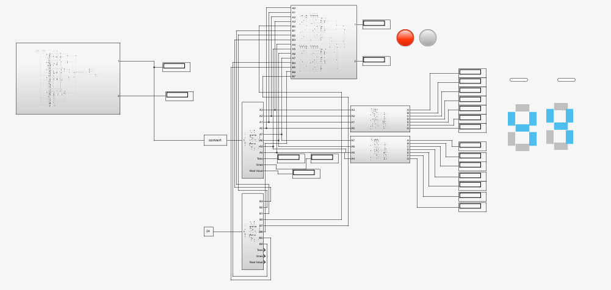

# Digital Logic Circuit Design Project

## 🎯 Project Overview

This repository contains the final project for the **Logic Circuit Design** course, developed in collaboration with **FIGES ENGINEERING**. The project demonstrates comprehensive digital circuit design principles using MATLAB Simulink, showcasing various digital components and their practical applications.

<div align="center">

<br></br>


*Industry Partner - FIGES Engineering* 

<br></br>

</div>

## 🏗️ System Architecture

<div align="center">


   
*Complete Digital Logic Circuit Implementation in MATLAB Simulink*

<br></br>
</div>

The project consists of several interconnected digital circuit modules:

### Core Components

#### 1. **Counter System**
- **5-bit binary counter** implemented using J-K flip-flops
- Clock-driven sequential logic
- Push button controls for increment/decrement operations
- Real-time speed control and monitoring

#### 2. **4-bit Comparator**
- Compares two 4-bit binary numbers (A and B)
- Outputs: A>B and A≤B comparison results
- Visual LED indicators for comparison results

#### 3. **BCD to 7-Segment Decoder**
- **Dual decoders** for tens and ones digits
- Complete 7-segment display drive logic
- Supports decimal numbers 0-99

#### 4. **Decimal to BCD Converter**
- Converts decimal input to Binary Coded Decimal
- Includes overflow protection (limiter version)
- Modulo-10 arithmetic implementation

## 🔧 Key Features

### Input Controls
- **Push Buttons**: Increment/Decrement counter values
- **Speed Limiting**: Configurable maximum speed (24 in limiter version)
- **Real-time Control**: Interactive system operation

### Display Systems
- **7-Segment LED Arrays**: Visual representation of decimal values
- **Status Indicators**: Multiple LED indicators for system states
- **Real-time Monitoring**: Live display of counter values and comparisons

### Logic Operations
- **Boolean Logic Gates**: AND, OR, NOT, XOR implementations
- **Sequential Circuits**: Flip-flop based state machines
- **Combinational Circuits**: Decoders, comparators, and converters

## 📁 File Structure

```
Logic-Circuit-Design/
├── Figes.slx                 # Main Simulink model file
├── README.md                 # Project documentation
├── images/                   # Project images and diagrams
│   ├── Figes.jpeg           # FIGES Engineering logo
│   ├── 7segment_display.png # Display interface
│   └── circuit_diagram.png  # Full circuit diagram
└── Documentation/            # Additional project documents
    ├── Circuit_Diagrams/     # Block diagrams and schematics
    ├── Truth_Tables/         # Logic truth tables
    └── Test_Results/         # Simulation results and verification
```

## 🚀 Getting Started

### Prerequisites
- MATLAB R2024b or later
- Simulink
- Simulink Extras Library
- HDL Simulator Library

### Installation & Setup

1. **Clone the repository**
   ```bash
   git clone https://github.com/yourusername/Logic-Circuit-Design.git
   cd Logic-Circuit-Design
   ```

2. **Open in MATLAB**
   ```matlab
   open('Figes.slx')
   ```

3. **Run the simulation**
   - Click the "Run" button in Simulink
   - Interact with push buttons to test functionality
   - Observe LED displays and indicators

## 🎮 How to Use

### Operating the Counter
1. **Start Simulation**: Click the run button
2. **Increment**: Press the "increase" push button
3. **Decrement**: Press the "decrease" push button
4. **Monitor**: Observe the 7-segment displays showing current count

### Testing the Comparator
1. The system automatically compares counter values with preset limits
2. **Green LED**: Indicates A≤B condition
3. **Red LED**: Indicates A>B condition

### Speed Control
- The system includes built-in speed limiting
- Maximum speed is configurable (default: 24)
- Real-time speed monitoring via display blocks

## 🧮 Circuit Details

### Counter Implementation
- **Technology**: J-K Flip-flops in cascade configuration
- **Capacity**: 5-bit (0-31 decimal)
- **Clock**: Digital clock with configurable frequency
- **Control Logic**: Boolean logic for increment/decrement operations

### BCD Decoder Logic
- **Input**: 4-bit BCD code (0000-1001)
- **Output**: 7-segment display patterns (a,b,c,d,e,f,g)
- **Implementation**: Combinational logic using truth tables

### Comparator Design
- **Architecture**: Parallel comparison of 4-bit words
- **Logic**: XOR gates for equality, cascaded logic for magnitude comparison
- **Output**: Binary comparison results with visual indicators

## 📊 Technical Specifications

| Component | Specifications |
|-----------|---------------|
| Counter Resolution | 5-bit (32 states) |
| Display Range | 0-99 decimal |
| Comparator Width | 4-bit parallel |
| Clock Frequency | Configurable |
| Update Rate | Real-time |
| Control Interface | Push button |

## 🔬 Testing & Verification

The project includes comprehensive testing for:
- ✅ Counter functionality (increment/decrement)
- ✅ BCD conversion accuracy
- ✅ 7-segment display output
- ✅ Comparator logic verification
- ✅ Speed limiting operation
- ✅ Push button responsiveness

## 🤝 Collaboration

This project was developed in collaboration with:
- **FIGES ENGINEERING** - Industry partnership and technical guidance
- **Course Professors** - Academic supervision and methodology
- **Project Team** - Design, implementation, and testing

## 📚 Learning Outcomes

Through this project, we demonstrated proficiency in:
- Digital circuit design principles
- Sequential and combinational logic
- MATLAB Simulink modeling
- Hardware simulation and verification
- Industry-standard design practices

## 🛠️ Tools & Technologies

- **MATLAB Simulink** - Circuit modeling and simulation
- **Digital Logic Libraries** - Standard logic gates and flip-flops
- **HDL Components** - Hardware description elements
- **Visual Displays** - LED arrays and 7-segment displays

## 📈 Future Enhancements

Potential improvements for this project:
- Extend counter to 8-bit capacity
- Add hexadecimal display mode
- Implement additional comparison operations
- Add memory storage functionality
- Create PCB layout for hardware implementation

## 📄 License

This project is developed for educational purposes as part of the Logic Circuit Design course curriculum.

## 🙏 Acknowledgments

Special thanks to:
- **FIGES ENGINEERING** for their invaluable industry insights and collaboration
- **Course Professors** for their guidance and expertise
- **MATLAB/Simulink** for providing robust simulation tools

---

**Course**: Logic Circuit Design  

**Institution**: Kadir Has University

**Industry Partner**: FIGES ENGINEERING

For technical support or collaboration opportunities, please contact toprakkamburoglu@gmail.com
